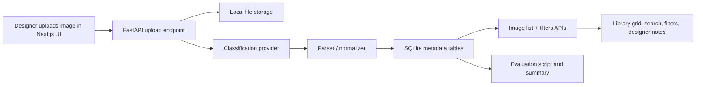

# Fashion AI App

Fashion AI App is a lightweight web application for organizing fashion inspiration imagery. Designers can upload field photos, generate structured garment metadata, search the library with dynamic filters, and add their own notes over time.

This project is intentionally scoped as a one-day proof of concept. The focus is on a strong end-to-end workflow, clean service boundaries, a realistic evaluation scaffold, and honest trade-offs.

## Demo Scope

- Upload garment or street-fashion images from the browser
- Store images locally and persist metadata in SQLite
- Generate structured AI metadata through a provider-based classification pipeline
- Browse the library in a visual grid
- Search across filenames and AI-generated metadata
- Filter by dynamic metadata values aggregated from stored data
- Add designer notes that remain distinct from AI-generated content

## Architecture



### Frontend

- `frontend/`
- Built with Next.js App Router and TypeScript
- Provides the upload flow, editorial-style library UI, live search, dynamic filters, and note entry

### Backend

- `backend/`
- Built with FastAPI, SQLModel, and SQLite
- Handles upload, storage, classification orchestration, filter aggregation, annotations, and evaluation-friendly APIs

### Evaluation

- `eval/`
- Contains dataset placeholders, label manifests, evaluation scripts, and generated summaries
- Designed so a manually labeled 50-100 image set can be dropped in without changing the app code

## Repository Structure

```text
backend/   FastAPI API, storage, schemas, services, and tests
frontend/  Next.js UI
eval/      evaluation scripts, labels, and summary output
README.md
```

## Key Technical Decisions

### Python-first backend

The role this project targets emphasizes AI systems and backend engineering, so the application logic is centered in Python. FastAPI was chosen to keep the service lightweight while still looking like a production-style API surface.

### Provider-based classification pipeline

Classification is intentionally split into:

- a provider layer
- a parser/normalizer layer
- a persistence layer

The current default experience uses a mock provider for local development, but the service boundary is ready for a real multimodal provider. This lets the project demonstrate AI-system structure without forcing external credentials to run the demo.

### Dynamic filters from stored metadata

Filter values are not hardcoded in the frontend. The backend aggregates current metadata values from the database and exposes them through `GET /api/filters`, which means available filter pills change as the image library changes.

### Real image thumbnails in the library

Uploaded images are served back through the backend and rendered directly in the library cards. This makes the app feel closer to a real inspiration board and keeps the metadata grounded in the source image.

### AI metadata and human notes are separate

AI-generated metadata is stored and displayed separately from designer annotations. This is important because several target attributes are subjective, and the product should support human correction rather than present AI output as ground truth.

## Current API Surface

- `GET /api/health`
- `POST /api/images/upload`
- `GET /api/images`
- `GET /api/filters`
- `POST /api/images/{image_id}/classify`
- `POST /api/images/{image_id}/annotations`

## Local Setup

### Backend

```bash
cd /Users/yuxiang/fashion-ai-app/backend
pip install -r requirements.txt
pytest
uvicorn app.main:app --reload
```

Optional environment setup:

```bash
cp /Users/yuxiang/fashion-ai-app/.env.example /Users/yuxiang/fashion-ai-app/.env
```

### Frontend

```bash
cd /Users/yuxiang/fashion-ai-app/frontend
npm install
npm run dev
```

Open:

- frontend: `http://localhost:3000`
- backend docs: `http://127.0.0.1:8000/docs`

## Evaluation Workflow

The evaluation scaffold is implemented, but the final labeled dataset still needs to be completed for submission-quality results.

Current workflow:

1. Place evaluation images in `eval/dataset/`
2. Run `python eval/scripts/bootstrap_labels.py`
3. Fill `eval/labels/candidate_labels.json` with manual expected labels
4. Run the evaluation script
5. Use the generated `eval/summary.md` in the final write-up

Example:

```bash
cd /Users/yuxiang/fashion-ai-app/backend
PYTHONPATH=/Users/yuxiang/fashion-ai-app/backend:/Users/yuxiang/fashion-ai-app python ../eval/run_eval.py
```

The scaffold currently reports per-attribute accuracy for:

- `garment_type`
- `style`
- `material`
- `occasion`
- `season`

## Labeling Rules For Fast Manual Evaluation

To keep the evaluation realistic and timeboxed, I would manually label only the fields that are most useful and reasonably observable:

- `garment_type`
- `style`
- `material`
- `occasion`
- `season`

Practical guidance:

- Leave a field blank rather than guessing if the image is too ambiguous
- Treat `garment_type` as the most objective baseline field
- Expect `material` and `occasion` to have more disagreement
- Avoid using `consumer_profile`, `trend_notes`, or `location context` as gold-label fields unless there is unusually clear evidence

## Testing

Current automated coverage includes:

- unit tests for classification parsing defaults and normalization
- API tests for upload, image listing, filtering, and annotations
- evaluation-summary tests for accuracy aggregation
- a Playwright happy-path test for upload, classify, and filter

## What Works Today

- Browser-based image upload
- Local image persistence
- Real image thumbnails in the library
- Placeholder classification and metadata persistence
- Live image listing
- Search and dynamic filter flows
- Designer note annotations
- Evaluation scaffold and reporting generation

## Known Limitations

- The default classifier is still mock-based unless a real provider is configured
- Images are stored locally instead of in cloud object storage
- Search is lexical and metadata-based, not embedding-based
- No auth or multi-user workflow is implemented
- The final 50-100 image labeled evaluation set has not yet been fully assembled
- The prompt asks for at least one end-to-end test, which is still outstanding

## Product and Model Caveats

Some target attributes are much more subjective than others.

More visually grounded fields:

- `garment_type`
- parts of `pattern`
- some color-related attributes

Less reliable or more subjective fields:

- `material`
- `occasion`
- `consumer_profile`
- `trend_notes`
- `location context`

For that reason, the product is designed to treat AI output as a searchable suggestion layer, not as authoritative truth.

## If I Had More Time

- Replace the mock provider with a real multimodal model by default
- Add image thumbnails to library cards
- Add a Playwright end-to-end test
- Expand filters to additional metadata dimensions
- Add richer search, including embedding-based retrieval
- Complete the final labeled evaluation set and error analysis

## Submission Status

This repository already demonstrates the requested end-to-end product shape and most of the engineering deliverables. The biggest remaining gap for a polished final submission is completing the real 50-100 image evaluation set and writing the final evaluation discussion around it.
